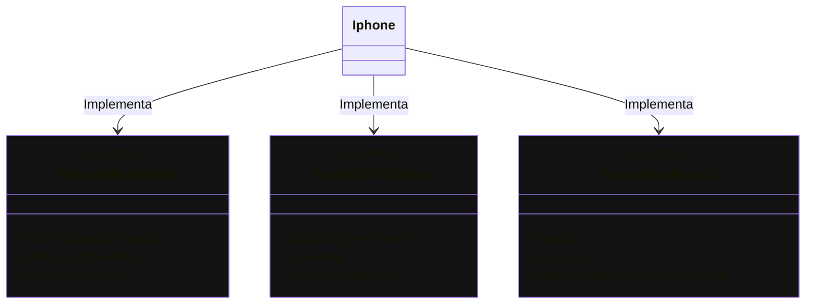

```mermaid

classDiagram

class Iphone

class  ReprodutorMusical
<<interface>> ReprodutorMusical
style ReprodutorMusical fill : #121212
ReprodutorMusical : + tocar()
ReprodutorMusical : + pausar()
ReprodutorMusical : + selecionarMusica(String musica)

class AparelhoTelefonico
<<interface>> AparelhoTelefonico
style AparelhoTelefonico fill : #121212
AparelhoTelefonico: + ligar(String numero)
AparelhoTelefonico : + atender()
AparelhoTelefonico : + iniciarCorreioVoz()

class NavegadorInternet
<<interface>> NavegadorInternet
style NavegadorInternet fill : #121212
NavegadorInternet : + exibirPagina(String url)
NavegadorInternet : + adicionarNovaAba()
NavegadorInternet : + atualizarPagina()

Iphone --> NavegadorInternet : Implementa
Iphone --> AparelhoTelefonico : Implementa
Iphone --> ReprodutorMusical : Implementa

```